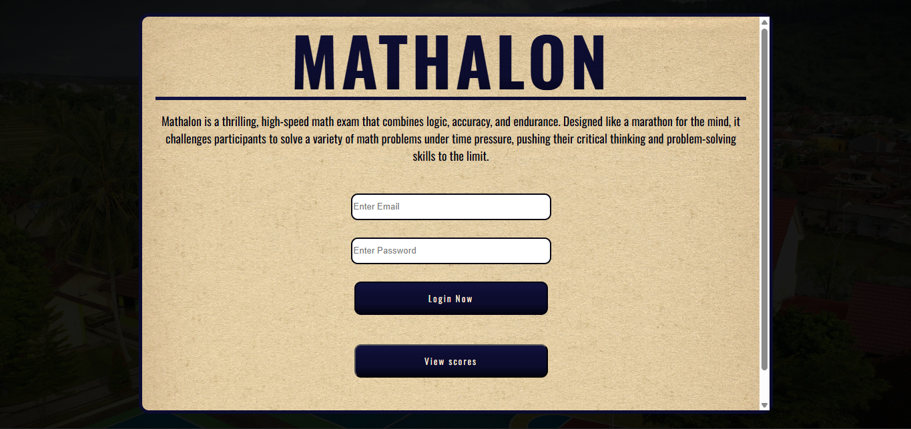
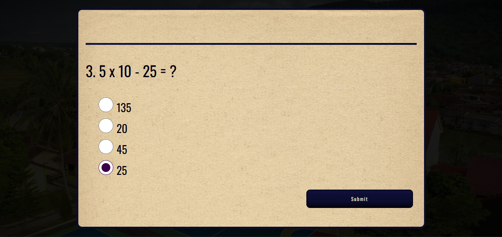
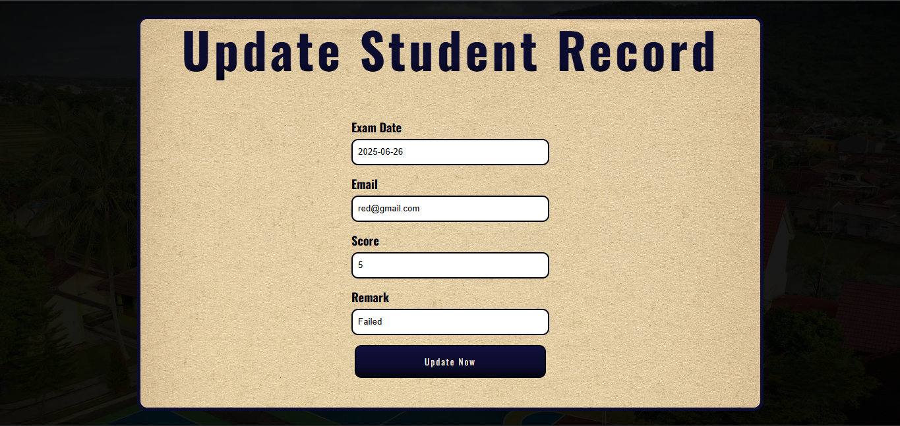

# MATHALON
Mathalon is a dynamic web-based mathematics quiz application built with HTML, PHP, and MySQL. Designed as a digital "marathon for the mind," Mathalon provides an engaging and interactive platform where users can challenge themselves with timed math questions while tracking their progress.

## Features
- **Interactive Quiz System** – Timed math questions designed to test speed and accuracy.
- **User Authentication** – Secure login and sign-up functionality for personalized access.
- **Score Tracking** – Automatic score calculation and progress monitoring after each quiz.
- **User Management** – Update or delete your account anytime for complete control.

## Preview

  
  
  
  
  
  

